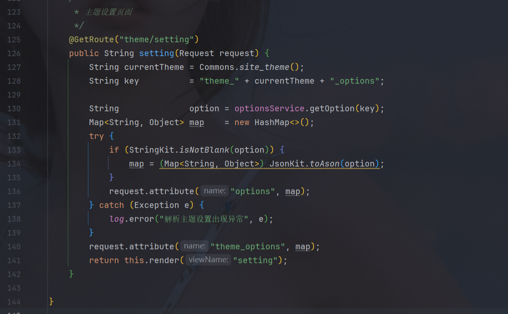
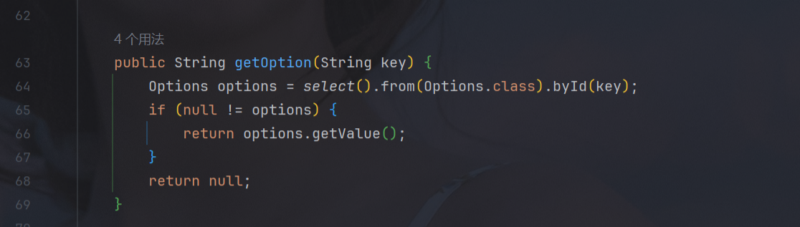
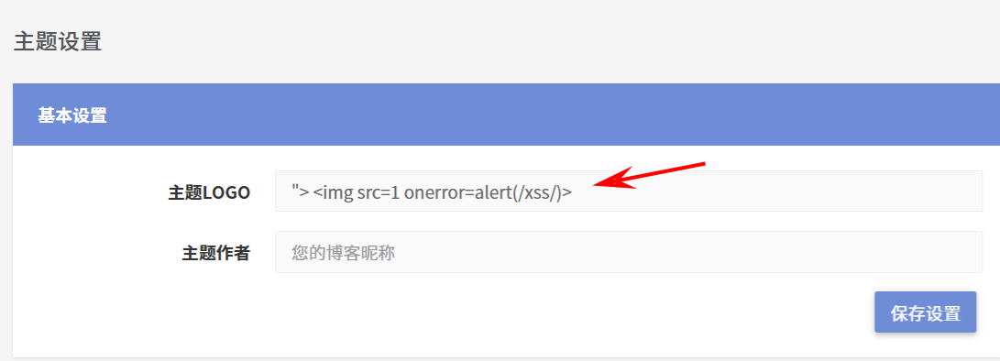
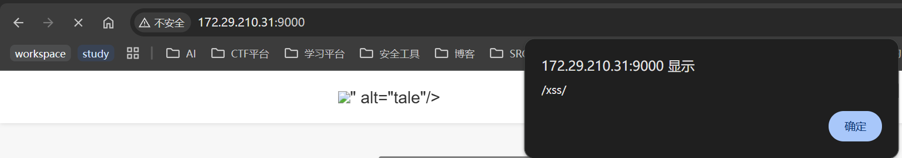

## vendor
https://github.com/otale/tale

## describe

```
In the OptionsService class, the application does not properly validate or filter the `themeUrl` input. This oversight allows an attacker to inject malicious JavaScript code through URL manipulation. By crafting a malicious URL that includes executable HTML or JavaScript content, an attacker can exploit this vulnerability to perform a Cross-Site Scripting (XSS) attack.
```

## code analyze

In the `theme/setting` route, the `logo_url` output provided by the user is not filtered or sanitized, allowing an attacker to inject content such as `"> ` to close HTML tags and execute JavaScript. This leads to a **Stored XSS** vulnerability.






## POC 


